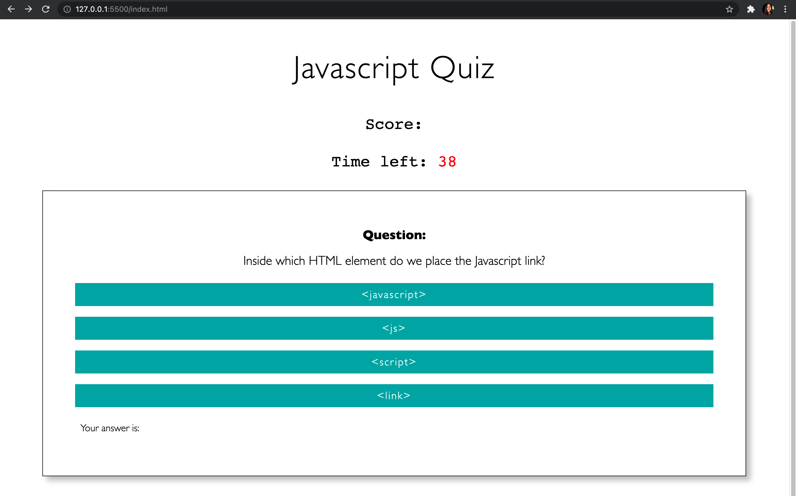

# Code Quiz

This Javascript quiz was created by myself(Analia). HTML, CSS and JS were utilized in order to populate the quiz answer and question, the high score submit page as well as the final high scores page.

# HTML files

- There are two HTML files used in the making of this quiz.
- The first one, index.hml, was used to develop the inital quiz page. This html page contains the main heading, a score tracker, a timer, a start button as well as the questions and answer choices, and a section that lets the user know if their answer was right or wrong.
- The first half of the second html file, score.html, includes a heading, the score the person recieved, an input field to submit their score along with their initials. There is also a play again button.  The second half of the file contains another heading and an unordered list (that has list items later appended to it) as well as another play again button.
- ** Experienced issues with the play again button not redirecting to the index.html page once the github site was published. In order to fix this, the links for the 'play again' buttons were replaced with the deployed github url as opposed to the index.html page. This seemed to work.**

# CSS files
- This CSS file styles all components included in both HTML files.

# JS files 
- Two JS files were used in the making of this quiz.
- The first JS file, script.js, contains functions that starts the game, shows the next question, sets the time as well as set the score and render the score. There is also an event listener included to detect which answer the person chose. Within the function included in the event listener, there is an if statement that checks if the answer is correct or incorrect and what to show the user if they get the answer right or wrong. This function also calls on the nextQuestion function. There is a second event listener that listens for a click on the 'start button', this lets the program know when to start the game.
-The second JS file, score.js, includes functions that display the last score and renders all the scores in local storage. There is also an event listener that listens for a 'submit'. The function included in this event listener retrieves old scores that were stored in local storage and adds any new scores to the old score array. The render scores function removes the first half of the score.html file and takes all exisiting scores in local storage and appends it to the unordered list as a list item. This is done to display all the final scores.

# Screenshot

# Deployed URL 
https://anamolly.github.io/Code_Quiz/